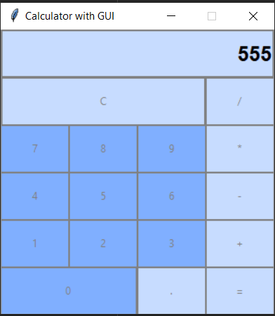

# Calculator-with-GUI
    Simple calculator with GUI on python

  Update ver = 0.0.2 ==> ver 0.0.3

    *add Math methods
    *add Math function

  Update ver = 0.0.1 ==> ver = 0.0.2

    *add GUI color correct

  Update ver = 0.0.1 ==> ver = 0.0.1

    *add Graphical User Interface (GUI)

  INFORMATION

    name = "Calculator with GUI",
    version = "0.0.3",
    author = "Hades",
    author_email = "bbakytbieku02@gmail.com",
    description = "Simple calculator with GUI.",
    classifiers = [
      "Programming Language :: Python :: 3.11"
    ],
    GitHub: "https://github.com/Hades-25060808"

